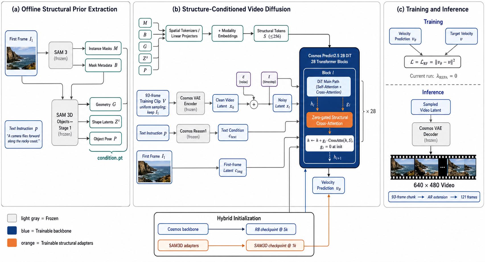

# GILWM INDER

**Cosmos Predict2.5 + SAM 3 / SAM 3D Objects for structure-conditioned video world modeling on Moore Threads MUSA.**

本仓库是基于 [NVIDIA Cosmos Predict2.5](https://github.com/nvidia-cosmos/cosmos-predict2.5) 的研究分支，加入了 SAM 3 / SAM 3D Objects 结构条件、视频数据采样、混合 checkpoint 初始化，以及在摩尔线程 MUSA 多机多卡环境中的训练和推理适配。

> 基线版本：`nvidia-cosmos/cosmos-predict2.5@a2c298b0a3df3778b973fe65e9e58877b292d8a7`
>
> 本仓库只发布代码、配置和复现实用脚本，不包含模型权重、训练数据、缓存、checkpoint 或运行日志。



## 方法概览

给定文本指令、首帧和训练视频，本方法在 Cosmos Predict2.5 2B Video2World 主干上增加结构条件通路：

1. **离线结构提取**：SAM 3 从首帧提取实例 mask 与元数据；SAM 3D Objects Stage 1 进一步生成几何图、物体形状 latent 和位姿。
2. **结构 token 化**：不同模态分别经过空间 tokenizer 或线性 projector，加入 modality embedding 后拼接为不超过 256 个结构 token。
3. **逐层注入**：Cosmos DiT 的 28 个 Transformer block 均加入一条结构 cross-attention 残差：

   ```text
   h <- h + g_l * CrossAttn(h, S)
   ```

   每层门控 `g_l` 从 0 初始化，因此加载原始 Cosmos 权重时，step 0 与未修改模型保持一致。
4. **训练目标**：当前正式配置使用 rectified-flow diffusion loss；REPA 实现保留为可选消融项，默认 `lambda_REPA = 0`，且未来帧 DINO teacher token 不作为推理条件。
5. **长视频生成**：当前训练使用 93 帧均匀采样并强制保留首帧；推理可单 chunk 生成，也可通过 AR 扩展到 121 帧。

### 条件缓存格式

每个样本对应一个固定形状的 `condition.pt`：

| 字段 | 形状 | 含义 |
|---|---:|---|
| `sam3d_tokens` | `[8, 256, 768]` | 冻结 DINOv2 teacher token；仅供可选 REPA 使用 |
| `sam_masks` | `[8, 120, 160]` | SAM 3 实例 mask |
| `sam_mask_meta` | `[8, 8]` | box、置信度、面积、提示编号和有效位 |
| `sam3d_geometry` | `[8, 120, 160]` | depth、XYZ、normal 和 confidence |
| `sam3d_shape_latents` | `[8, 256, 8]` | SAM 3D Objects Stage-1 shape latent |
| `sam3d_object_pose` | `[8, 10]` | translation、quaternion 和 scale |

缓存路径与数据目录一一对应：

```text
CACHE_ROOT/<batch>/<question_id>/condition.pt
```

## 主要改动

- SAM 3 / SAM 3D Objects 多模态结构条件和独立 cross-attention 通路。
- zero-gated adapter，兼容原始 Cosmos checkpoint。
- 可选 relation REPA 与 projected-cosine REPA。
- 支持从两个 checkpoint 混合初始化：Cosmos 主干来自一个 checkpoint，SAM3D adapter 来自另一个 checkpoint。
- Manifest 驱动的视频数据集，支持按 batch 过滤。
- 训练视频短于目标帧数时过滤；长视频可连续截取或均匀采样。
- 93 帧、`480 x 640`、多机 32 卡 FSDP 训练配置。
- MUSA/MCCL、FSDP checkpoint、EMA、attention 和设备 API 适配。
- Benchmark50 / WorldArena Track 1 的并行推理、AR 扩展和输出校验脚本。

## 目录结构

```text
cosmos_predict2/
  _src/predict2/
    datasets/local_datasets/sam3d_video_dataset.py
    models/sam3d_video2world_model.py
    networks/sam3d_conditioned_dit.py
    sam3d/                         # condition dataclass / conditioner
  experiments/sam3d_world_model.py
projects/sam3d/
  train_v93.sh                    # 便携式 93 帧训练入口
  scripts/                        # 预处理、训练、推理、校验和集群脚本
  configs/                        # 环境清单与示例配置
tests/sam3d/                      # adapter、dataset、cache、REPA 单元测试
docs/method_overview.png
```

## 环境要求

本分支面向 MUSA，不是原始 CUDA 分支。已验证环境包括：

- Moore Threads MTT S5000 80 GB
- 4 节点 x 8 卡
- MUSA 驱动 `3.3.5-server`
- `mthreads-gmi 2.3.2`
- PyTorch + `torch_musa`
- Python 3.10
- Docker、MCCL、FSDP2

Python 包快照见 `projects/sam3d/configs/cosmos-musa-pip-freeze.txt`。厂商运行时镜像和驱动需要按实际集群环境提供，仓库不分发私有镜像。

还需要自行准备并遵守各自许可证：

- Cosmos Predict2.5 2B、Cosmos Reason1 7B 和 Cosmos VAE 权重
- SAM 3 checkpoint
- SAM 3D Objects checkpoint
- DINOv2 源码/权重（仅预处理或可选 REPA）
- MoGe 权重（原生 SAM 3D Objects 预处理需要）

## 数据格式

WorldArena/RoboTwin HDF5 动作 sidecar、FlowWAM 兼容性结论和动作监督训练参数见
[WorldArena H5、FlowWAM 与动作监督接入说明](docs/worldarena_flowwam_action_integration_cn.md)。
按 FlowWAM 思路重构、但原生适配 Cosmos 2048 维特征的多层 Action Expert 见
[Cosmos 原生 Action Expert 设计](docs/cosmos_action_expert_cn.md)。

推荐使用 `manifest.jsonl`。每行至少包含：

```json
{"batch":"core15k","question_id":"core15k_00000001","video":"core15k/core15k_00000001/video.mp4","instruction":"core15k/core15k_00000001/instruction.json","sample_dir":"core15k/core15k_00000001"}
```

目录示例：

```text
DATASET_ROOT/
  manifest.jsonl
  core15k/
    core15k_00000001/
      video.mp4
      first_frame.png
      instruction.json
```

`instruction.json` 可以直接包含 `{"instruction": "..."}`，也兼容 Cosmos 原有的多级 caption JSON。

当前 dataloader 默认逻辑：

- `num_frames=93`
- `sampling_mode=uniform`
- 总帧数小于 93 的视频直接过滤
- 大于 93 帧时在完整时间轴上均匀采样
- 始终保留原视频首帧和末帧
- 根据采样跨度修正 effective FPS

## 条件预处理

### 1. 生成 SAM 3 mask 与 DINO teacher cache

```bash
python projects/sam3d/scripts/prepare_sam3d_conditions.py \
  --dataset-root "$DATASET_ROOT" \
  --manifest "$DATASET_ROOT/manifest.jsonl" \
  --cache-root "$SAM3D_CACHE_ROOT" \
  --sam3-checkpoint "$SAM3_CHECKPOINT" \
  --dino-repo "$DINOV2_REPO" \
  --teacher-frames 8 \
  --minimum-frames 93 \
  --device musa:0
```

可使用 `--num-shards` 与 `--shard-index` 在多张卡上并行预处理。

### 2. 生成原生 SAM 3D Objects sidecar

`projects/sam3d/scripts/prepare_sam3d_object_sidecars.py` 与对应 `.sbatch` 脚本负责调用官方 SAM 3D Objects Stage 1。该步骤可以在独立 CUDA 机器完成，再把 sidecar 放回训练集群；训练机不需要在线下载权重。

### 3. 合并并校验

```bash
python projects/sam3d/scripts/merge_sam3d_object_sidecars.py \
  --base-cache-root "$SAM3D_CACHE_ROOT" \
  --sidecar-root "$SAM3D_OBJECTS_ROOT" \
  --output-root "$SAM3D_MERGED_CACHE_ROOT" \
  --overwrite

python projects/sam3d/scripts/validate_sam3d_cache.py \
  "$SAM3D_MERGED_CACHE_ROOT" \
  --require-nonzero-tokens \
  --require-masks \
  --require-geometry \
  --require-sam3d-objects
```

## 训练

### 当前 32 卡配置

| 参数 | 值 |
|---|---:|
| 节点 / GPU | `4 x 8` |
| 每卡 batch size | `4` |
| 全局 batch size | `128` |
| 帧数 | `93` |
| 分辨率 | `480 x 640` |
| optimizer | AdamW |
| peak learning rate | `3e-5` |
| warmup | `500 iter` |
| scheduler | cosine, cycle `5000 iter` |
| checkpoint interval | `500 iter` |
| REPA weight | `0`（默认） |

四个节点分别执行：

```bash
export COSMOS_SAM3D_WORKSPACE=/path/to/runtime-workspace
export COSMOS_PROJECT=/path/to/gilwm_inder
export COSMOS_MUSA_IMAGE=<your-musa-runtime-image>

export SAM3D_DATASET_ROOT=/path/to/train_data
export SAM3D_CACHE_ROOT=/path/to/merged_cache
export SAM3D_OBJECTS_ROOT=/path/to/object_sidecars
export SAM3D_BASE_CHECKPOINT=/path/to/sam3d_adapter_checkpoint
export SAM3D_COSMOS_OVERLAY_CHECKPOINT=/path/to/cosmos_backbone_checkpoint

export MASTER_ADDR=<rank-0-host>
export MASTER_PORT=29932
export NNODES=4
export MAX_ITER=5000
export SAVE_ITER=500
export PER_DEVICE_BATCH_SIZE=4
export SAM3D_RUN_NAME=my_sam3d_run

# NODE_RANK 分别为 0、1、2、3
bash projects/sam3d/train_v93.sh "$NODE_RANK"
```

混合初始化顺序为：先加载 `SAM3D_BASE_CHECKPOINT` 中的 SAM3D adapter，再使用 `SAM3D_COSMOS_OVERLAY_CHECKPOINT` 覆盖所有同名 Cosmos 主干参数。训练状态不继承，iteration 从 0 开始。

若从一个完整训练 checkpoint 继续恢复，请使用原始 Hydra checkpoint 入口并启用 training-state load；不要再设置 overlay。

## 推理与评测

常用入口位于 `projects/sam3d/scripts/`：

- `run_sam3d_inference_smoke.sh`：单样本 121 帧 smoke test
- `run_sam3d_ar93_smoke.sh`：93 帧 chunk 的 AR 测试
- `prepare_sam3d_benchmark50_ar.py`：Benchmark50 输入准备
- `launch_sam3d_benchmark50_ar_workers.sh`：多卡 Benchmark50 推理
- `prepare_sam3d_track1_ar.py`：WorldArena Track 1 输入准备
- `launch_sam3d_track1_ar_32x1gpu.sh`：32 卡并行 Track 1 推理
- `verify_video_output.py`：分辨率、帧数和 FPS 校验

公开脚本保留了验证集群上的参考默认路径，部署到其他环境时请优先通过命令行参数或环境变量覆盖。

## 测试

不加载大模型权重的核心测试：

```bash
python tests/sam3d/test_sam3d_conditioned_dit.py
python tests/sam3d/test_sam3d_repa_loss.py
python projects/sam3d/scripts/test_merge_sam3d_object_sidecars.py

# 需要提供一个真实 cache
python tests/sam3d/test_sam3d_dataset_cache.py /path/to/condition.pt
```

完整 MUSA smoke test 还需要本地 Cosmos、SAM 3 和 SAM 3D Objects 权重。

## Checkpoint 兼容性

- 原始 Cosmos checkpoint 可以非严格加载，新增结构 adapter 使用初始化值。
- SAM3D checkpoint 可继续用于普通 Cosmos + SAM3D 推理。
- 当前版本默认不把 teacher token 当作输入，因此推理只需要首帧产生的结构条件。
- 启用 REPA 会额外创建 student projection head；无 REPA 与 REPA checkpoint 的结构并不完全相同，应使用 non-strict load 或对应配置。

## 已知限制

- 原生 SAM 3D Objects sidecar 依赖其官方 Stage-1 环境和权重。
- MUSA/MCCL 多机训练对 IB 链路稳定性敏感，建议启用独立任务监控和 checkpoint 自动恢复。
- 121 帧、`640 x 480` 推理在当前实现中通常使用 93 帧 chunk 加 AR 扩展；并非训练时一次性输入 121 帧。
- 本仓库尚未提供预训练权重的公开下载地址。

## 许可证与引用

本仓库继承上游 Cosmos Predict2.5 的 Apache-2.0 许可证，详见 [LICENSE](LICENSE) 和 [ATTRIBUTIONS.md](ATTRIBUTIONS.md)。SAM 3、SAM 3D Objects、DINOv2、MoGe 和相关权重仍受各自许可证约束。

如果使用本仓库，请同时引用 NVIDIA Cosmos Predict2.5 以及实际使用的 SAM / SAM 3D / DINOv2 组件。

## Acknowledgements

Built on NVIDIA Cosmos Predict2.5, Meta SAM 3, SAM 3D Objects, DINOv2, and the Moore Threads MUSA software stack.
